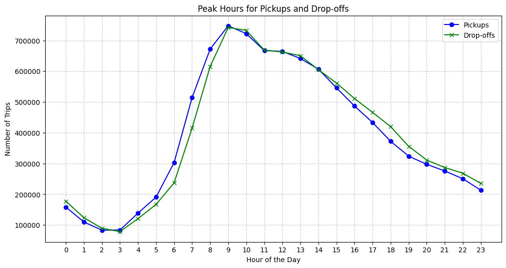
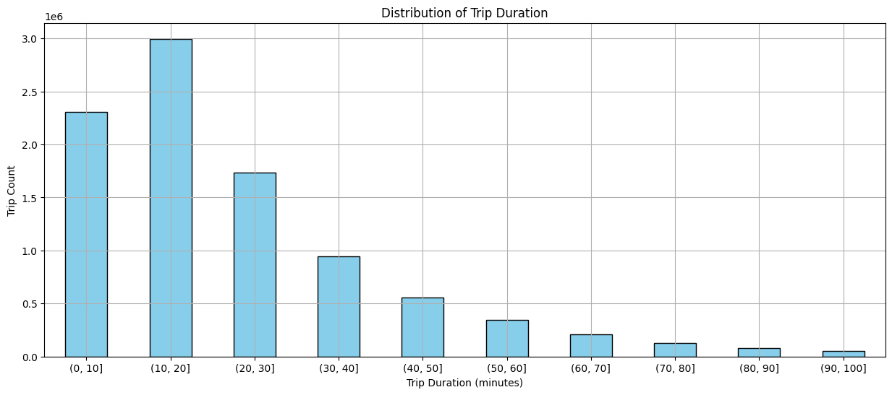
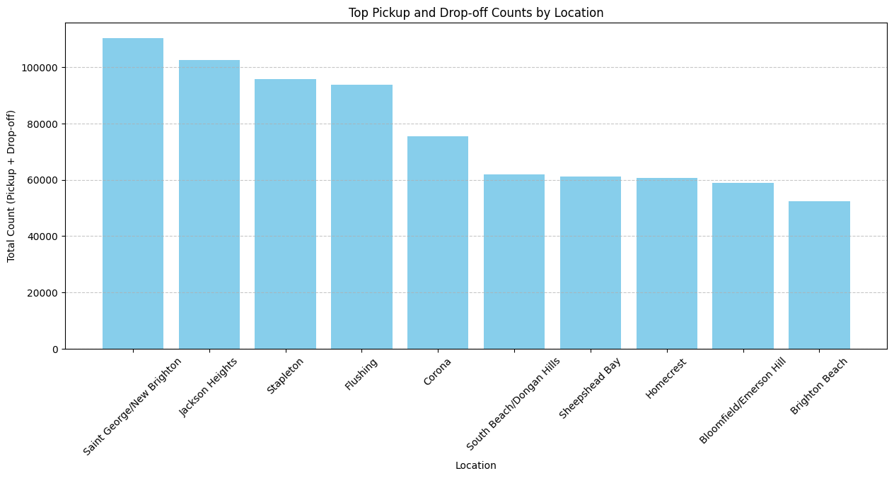
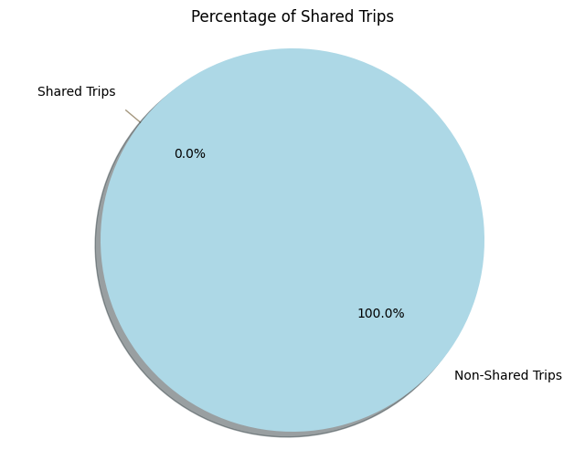

# For-Hire Vehicle Data Analysis Results

### 1. What are the peak hours for pickups and drop-offs?

As shown in the graph below, the peak hours for daily pickups and drop-offs are 8-11 am.

Pickup Count | Dropoff Count
-------------|----------------
158387       | 177308
109664       | 123789
83270        | 89190
83576        | 78451
138770       | 120793
190502       | 166824
302944       | 236924
514671       | 415470
672087       | 615578
747535       | 742220
722106       | 732748
667181       | 668503
664304       | 662468
641395       | 650355
606753       | 604941
545968       | 561427
486766       | 511219
433242       | 466160
372378       | 419910
323848       | 355901
297243       | 311225
275716       | 286899
250472       | 268322
213189       | 235342

### 2. What does the distribution of trip duration look like?

Only trips within 100 mins are evaluated. We could see that most trips are completed within 30 mins.

### 3. Which locations are the most common pickup and drop-off points?

Pickup Count | Drop-off Count | Zone
-------------|----------------|----------------------------
53386        | 42297          | Stapleton
52715        | 57558          | Saint George/New Brighton
32295        | 43033          | Corona
32032        | 61624          | Flushing
30655        | 71891          | Jackson Heights
29384        | 32491          | South Beach/Dongan Hills
28252        | 32455          | Homecrest
27581        | 31396          | Bloomfield/Emerson Hill
27097        | 25246          | Brighton Beach
26399        | 34851          | Sheepshead Bay

### 4. What is the percentage of shared rides among all the trips?

Although being specifically mentioned in the data dictionary, there seems to be no shared trips in FHV Trip Records in 2024.

Total Trips | Shared Trips | Percentage of Shared Trips
------------|--------------|-----------------------------
9501967     | 0            | 0.0

