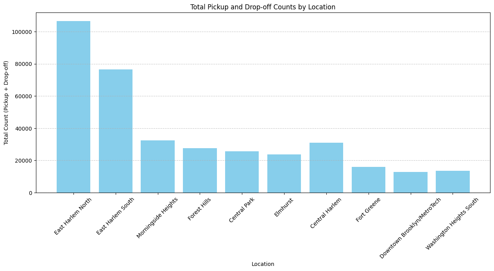
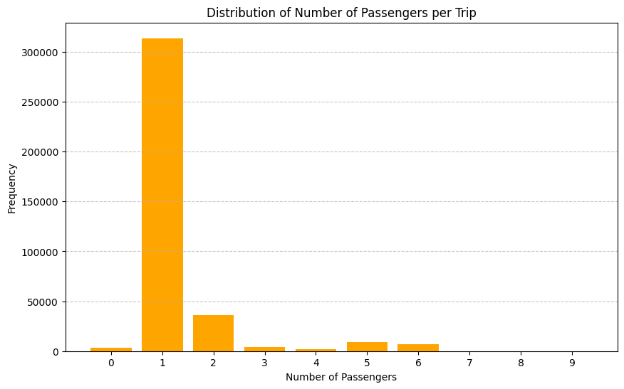
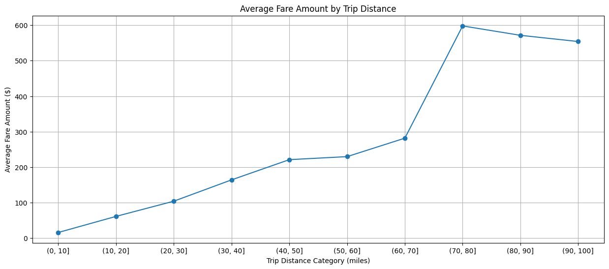
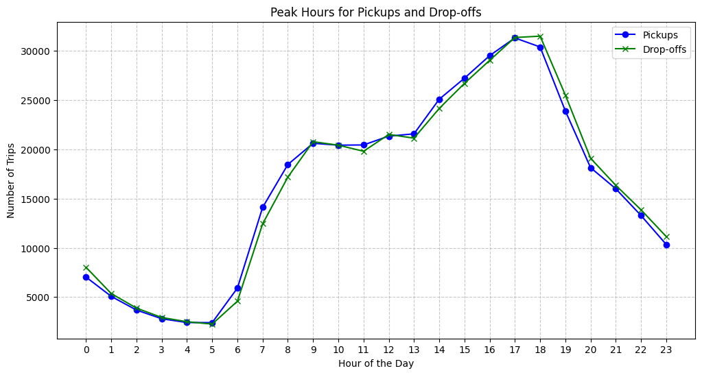
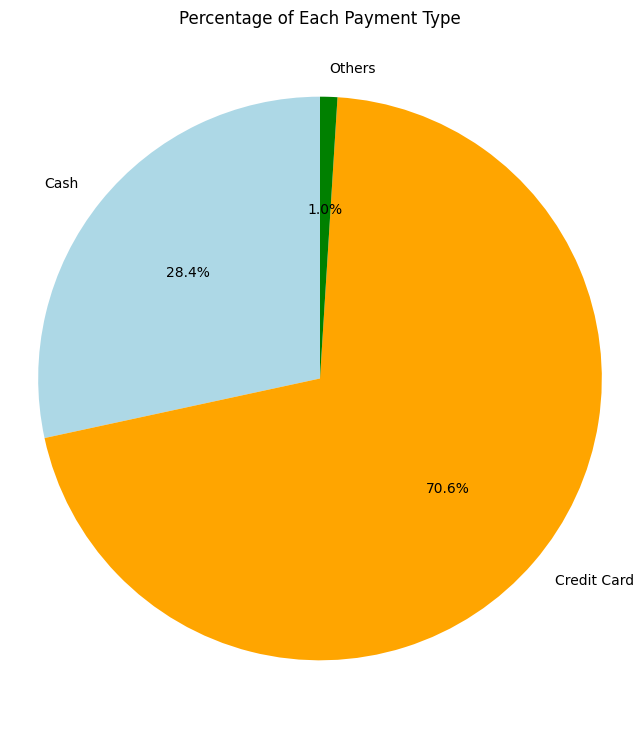
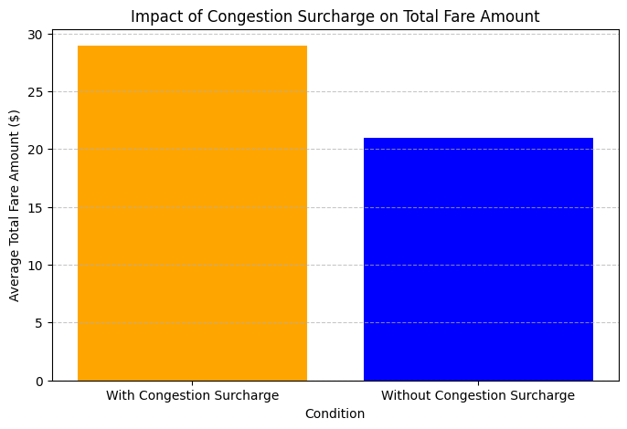
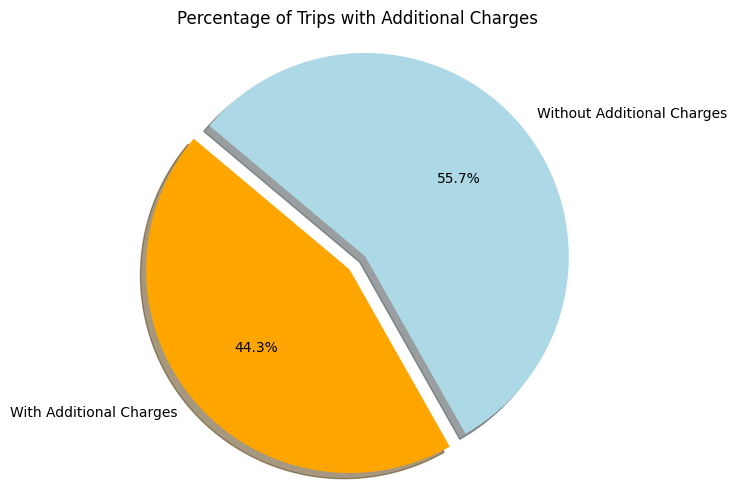
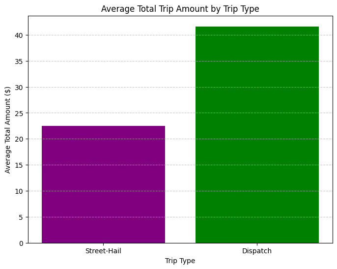
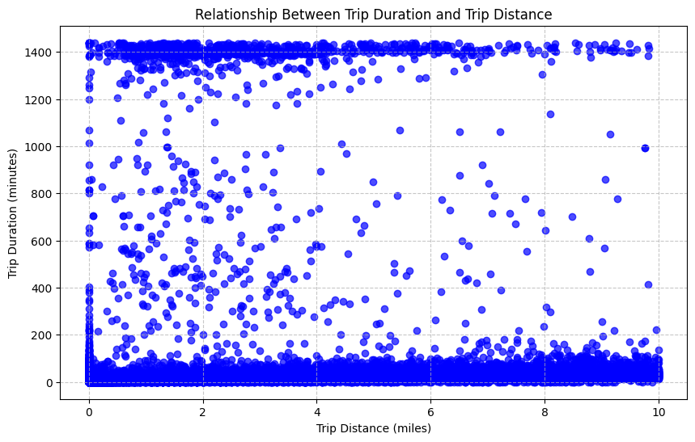

# Green Taxi Data Analysis Results

### 1. What is the average trip distance for green taxi rides?

The average trip distance for green taxi rides is 16.42 miles.

### 2. Which locations are the most common pickup and drop-off points?

Pickup Count | Drop-off Count | Zone
-------------|----------------|------------------------------
86766        | 19738          | East Harlem North
55028        | 21504          | East Harlem South
19927        | 12584          | Morningside Heights
19456        | 8233           | Forest Hills
19253        | 6350           | Central Park
18509        | 5222           | Elmhurst
17738        | 13266          | Central Harlem
12495        | 3440           | Fort Greene
11459        | 1442           | Downtown Brooklyn/MetroTech
8829         | 4660           | Washington Heights South

The graph below illustrates the total combined pickup and drop-off counts for each Location. The bars represent the frequency of taxi activity at each location, providing a clear view of the most popular areas.

### 3. What is the distribution of the number of passengers per trip?

Passenger Count | Frequency
----------------|------------
1               | 313774
2               | 36279
5               | 9221
6               | 6820
3               | 4082
0               | 3628
4               | 1945
9               | 30
8               | 21
7               | 16

The graph below shows the distribution of the number of passengers per trip in descending order. Each bar represents the frequency of trips with a specific number of passengers.

### 4. What is the average fare amount per trip, and how does it vary by trip distance

The average fare amount of each trip is $17.85.

Generally, as the total trip distance goes up, the taxi fare amount increases as well. In addition, we could see a sharp increase in fare when the trip distance goes beyond 70 miles.

### 5. What are the peak hours for pickups and drop-offs?

Hour | Pickup Count | Dropoff Count
-----|--------------|----------------
0    | 7031         | 8024
1    | 5071         | 5356
2    | 3683         | 3881
3    | 2803         | 2929
4    | 2416         | 2497
5    | 2410         | 2260
6    | 5919         | 4583
7    | 14115        | 12444
8    | 18469        | 17194
9    | 20624        | 20783
10   | 20431        | 20431
11   | 20454        | 19813
12   | 21351        | 21519
13   | 21582        | 21145
14   | 25096        | 24158
15   | 27234        | 26707
16   | 29525        | 29047
17   | 31325        | 31366
18   | 30405        | 31505
19   | 23913        | 25528
20   | 18148        | 19103
21   | 16004        | 16354
22   | 13288        | 13866
23   | 10347        | 11151

The graph below shows the total pickup and drop-off counts of each hour of the day. We could see that there are 2 periods of peak hours in a day, morning peak is 8-10 am, and night peak is 16-18 pm, when the majority are on their way to work/home.

### 6. What is the percentage of each payment type for the trips?

Payment Type | Count  | Percentage
-------------|--------|-------------
Cash         | 106698 | 28.39
Credit Card  | 265385 | 70.62
Others       | 3733   | 0.99

From the pie chart below, we find that although the majority number of passengers choose cashless payment as their major payment method, there are still quite a number of passengers prefer to pay cash, as of 2024.

### 7. What is the impact of the congestion surcharge on the total fare amount?

The table and bar chart below show the impact of the congestion surcharge on the total fare amount. Trips with the congestion surcharge have a higher average total amount compared to those without the surcharge.

Condition                    | Average Total Amount
-----------------------------|------------------------
With Congestion Surcharge    | 28.94
Without Congestion Surcharge | 20.98

### 8. What percentage of trips include additional charges like tolls or extra fees?

Total Trips | Trips with Additional Charges | Percentage with Charges
------------|-------------------------------|--------------------------
391644      | 173500                        | 44.300436

### 9. How does the total trip amount vary across different trip types?

The bar chart and table below show how the average total trip amount varies between different trip types. Dispatch trips tend to have a higher average total amount compared to street hail trips.

trip_type   | total_amount
------------|---------------
Street-Hail | 22.52
Dispatch    | 41.62

### 10. What is the relationship between trip duration and trip distance?

The correlation between trip duration and trip distance 0.1, indicating a pretty weak correlation between the two factors, which is an interesting fact that worth digging further.

