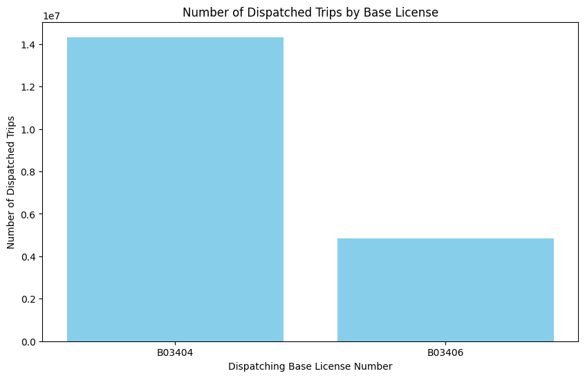
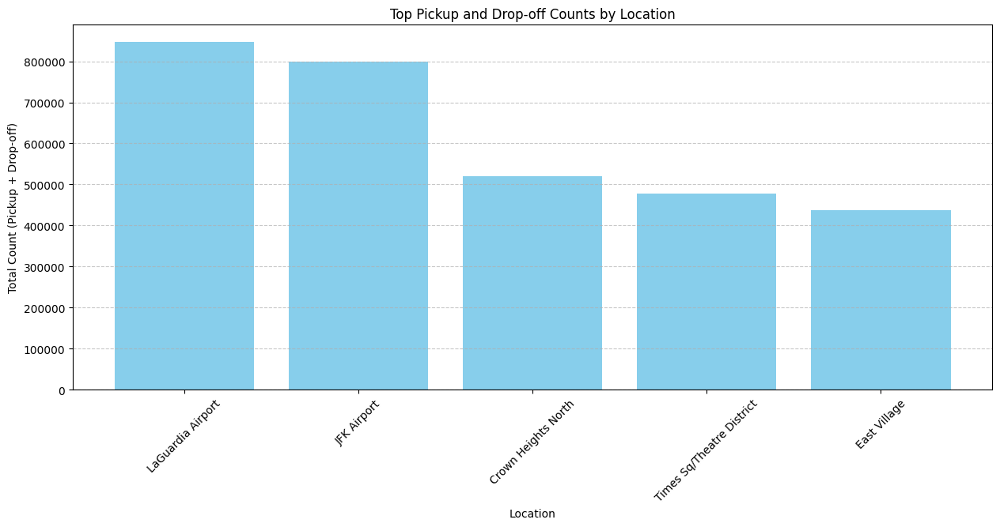
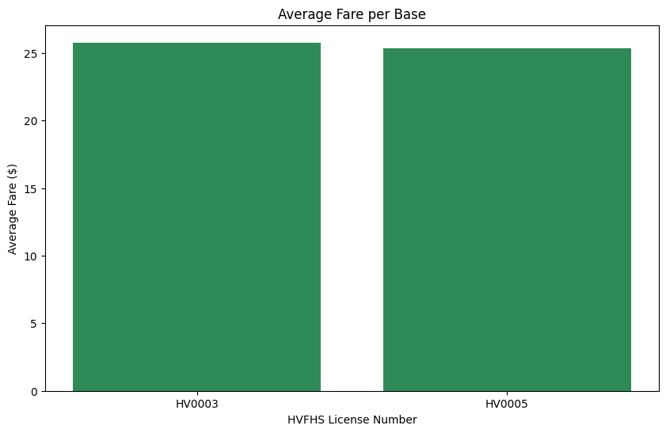
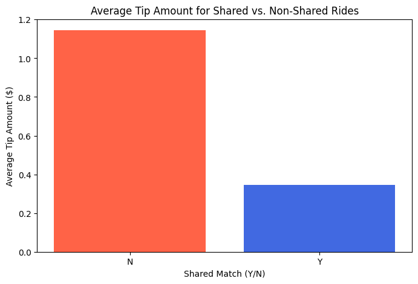
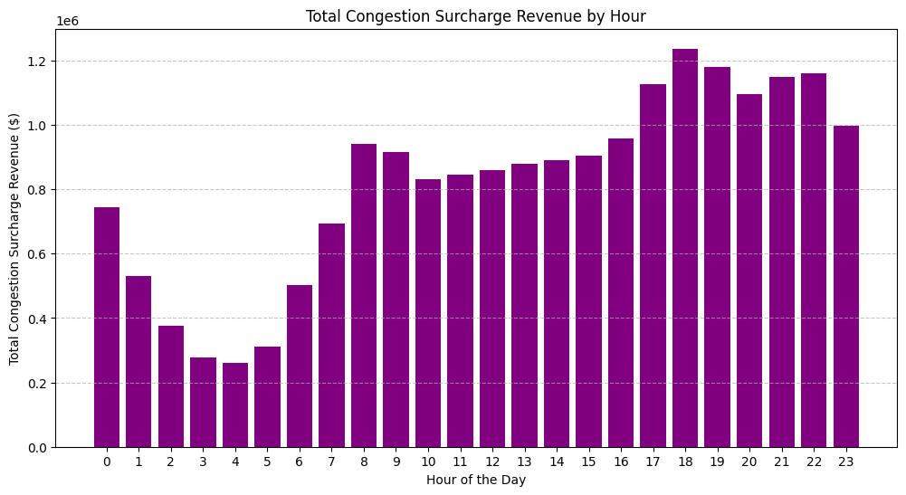
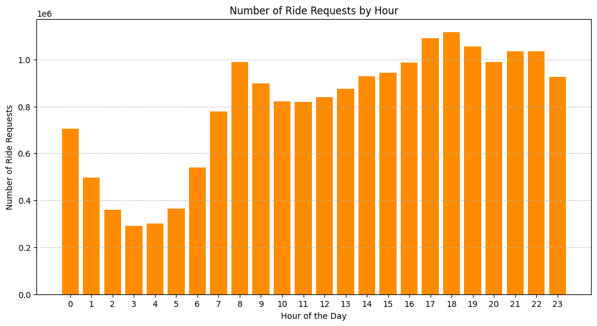
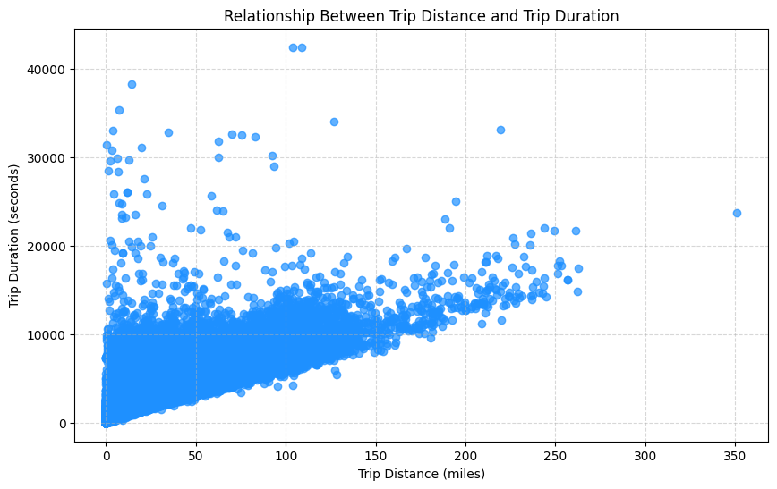
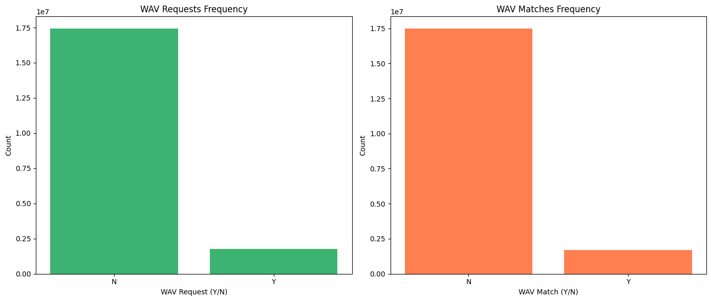
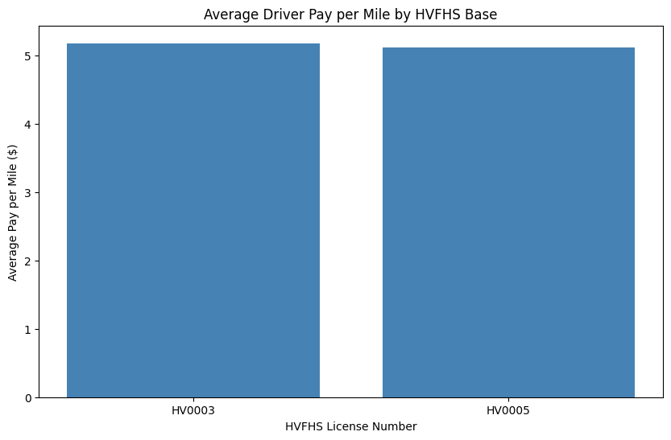

# High Volume For-Hire Vehicle Data Analysis Results

### 1. What is the average trip duration for all trips?

The average trip duration is 19.67 mins.

### 2. Which TLC Base License has the highest number of dispatched trips?

dispatching_base_num | trip_count
---------------------|-------------
B03404 (Uber)        | 14328764
B03406 (Lyft)        | 4854170

### 3. What are the top 5 most common pick-up and drop-off locations?

Pickup Count | Drop-off Count | Zone
-------------|----------------|----------------------------
400085       | 446384         | LaGuardia Airport
366480       | 431862         | JFK Airport
257286       | 263478         | Crown Heights North
253138       | 225086         | Times Sq/Theatre District
241106       | 196599         | East Village

### 4. What is the average fare for trips based on different bases?

Lyft usually has a slightly lower passenger fare compared to Uber, but the difference is rather negligible.

hvfhs_license_num | average_fare
------------------|---------------
HV0003 (Uber)     | 25.76
HV0005 (Lyft)     | 25.34

### 5. How does the average tip amount vary between shared and non-shared rides?

The average tip amount of non-shared rides is much higher than that of shared rides, which is reasonable as passengers booking shared rides are usually pursuing lower total ride fare.

shared_match_flag | average_tip
------------------|---------------
N                 | 1.14
Y                 | 0.34

### 6. What is the total revenue generated from congestion surcharges for a specified time period?

As expected, the highest total congestion surcharge appears during night peak (at ~6 pm), and the congestion surcharge is the lowest during late midnight (3-5 am).

### 7. Which time of day has the highest number of ride requests?

the high number of ride requests happen during morning peak (~8 am) and night peak (18 pm), when the majority are on their way to work/home. The lowest requests appear during late midnight (3-5 am), when most people are asleep.

### 8. What is the relationship between trip distance and trip duration?

The correlation between trip distance and trip duration is 0.81, indicating a strong and positive correlation between the two factors, which is expected.

### 9. How frequently do passengers request wheelchair-accessible vehicles, and how often are they matched?

wav_request_flag | count
-----------------|-----------
N                | 17414840
Y                | 1768094

wav_match_flag | count
---------------|-----------
N              | 17470110
Y              | 1712824

Percentage of passengers requested WAV: 9.22%
Percentage of passengers who requested WAV eventually got a successful match: 96.87%

### 10. What is the average driver pay per mile for each HVFHS base?

The average driver pay per mile is higher for Uber drivers compared to Lyft drivers. It is reasonable as Uber tends to charge more to passengers (as mentioned in P4).

hvfhs_license_num | average_pay_per_mile
------------------|------------------------
HV0003 (Uber)     | 5.18
HV0005 (Lyft)     | 5.11

