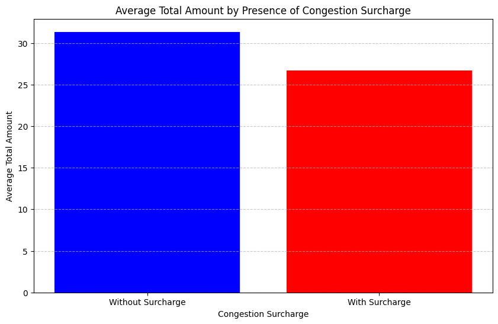

# Yellow Taxi Data Analysis Results

### 1. What is the average trip distance for all rides?

The average trip distance is 4.76 miles.

### 2. How does the average fare amount vary by passenger count?

passenger_count | fare_amount
----------------| ------------
0               | 17.02
1               | 18.31
2               | 21.14
3               | 21.17
4               | 23.24
5               | 18.56
6               | 17.88
7               | 49.44
8               | 78.99
9               | 78.08

### 3. What is the most common payment type used by passengers?

Payment Type    | Count
----------------|----------
1 (Cash)        | 17364598
2 (No charge)   | 3227644
0 (Credit card) | 2254974
4 (Unknown)     | 403696
3 (Dispute)     | 158080
5 (Voided trip) | 4

### 4. Is there a correlation between trip distance and tip amount?

The correlation between trip distance and tip amount is 0.55, indicating a decent positive relationship.

### 5. Which hours of the day see the highest number of pickups?

Hour | Pickup Count
-----|---------------
0    | 673104
1    | 437792
2    | 285665
3    | 188944
4    | 138171
5    | 148006
6    | 330365
7    | 646670
8    | 902440
9    | 984098
10   | 1048285
11   | 1137769
12   | 1249079
13   | 1299653
14   | 1391029
15   | 1422817
16   | 1445173
17   | 1589449
18   | 1671734
19   | 1466943
20   | 1323434
21   | 1367973
22   | 1275954
23   | 984449

### 6. How do total amounts vary between trips with and without congestion surcharges?

Congestion Surcharge | Average Total Amount
---------------------|-----------------------
False                | 31.35
True                 | 26.69

### 7. What is the distribution of trip distances across different times of the day?

#              | count   | mean | std  | min | 25%  | 50%  | 75%  | max
---------------|---------|------|------|-----|------|------|------|--------
<b>time_of_day |
Night          | 1712245 | 2.62 | 2.14 | 0.0 | 1.10 | 1.93 | 3.51 | 10.0
Morning        | 4637325 | 2.19 | 1.96 | 0.0 | 0.95 | 1.57 | 2.60 | 10.0
Afternoon      | 7682391 | 2.12 | 1.92 | 0.0 | 0.91 | 1.50 | 2.50 | 10.0
Evening        | 7530201 | 2.34 | 1.96 | 0.0 | 1.04 | 1.71 | 2.91 | 10.0

### 8. What is the percentage of airport rides?

The percentage of airport rides is 7.78%.

### 9. What is the trend in the total number of trips over time (e.g., daily, monthly)?

Month   | Trip Count
--------|-------------
2024-01 | 2964617
2024-02 | 3007533
2024-03 | 3582611
2024-04 | 3514295
2024-05 | 3723843
2024-06 | 3539170
2024-07 | 3076859

### 10. Which factors (e.g., trip distance, time of day) most significantly influence the fare amount?

The correlation matrix shows the relationships between various factors and the fare amount:
- Trip Distance (0.21): The most significant factor influencing the fare amount, showing a weak positive correlation.
- Passenger Count (0.01): Has a weaker positive correlation with fare amount compared to trip distance, suggesting that the passenger count does not have much impact on the fare.
- Pickup Hour (-0.0): Shows no correlation with fare amount, indicating that the pickup hour has a minimal inverse effect.

